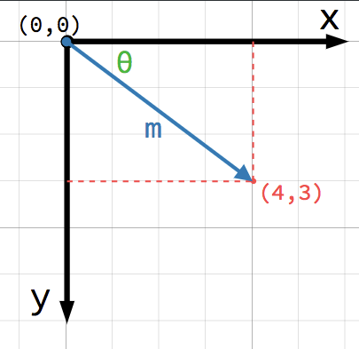
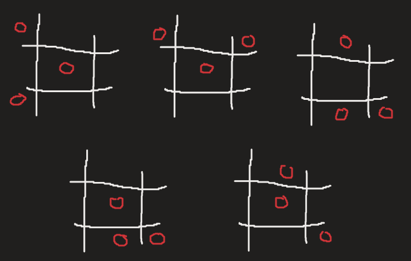

# Godot Game Engine

## Indice

- [Godot Game Engine](#godot-game-engine)
  - [Indice](#indice)
  - [Introduzione](#introduzione)
  - [Concetti di Godot da conoscere](#concetti-di-godot-da-conoscere)
    - [Nodo](#nodo)
    - [Signals](#signals)
    - [Vector2](#vector2)
  - [Tic Tac Toe](#tic-tac-toe)
    - [Guida al gioco](#guida-al-gioco)
    - [Singleplayer](#singleplayer)
    - [Multiplayer](#multiplayer)
    - [Comandi di gioco](#comandi-di-gioco)

## Introduzione

**Godot** è un motore grafico open-source sviluppato e supportato dalla stessa community. Tutt'ora questo progetto sta crescendo sempre di più, grazie alla sua **semplicità** e **velocità** con cui è possibile creare il proprio videogioco.

I linguaggi utilizzati da Godot sono **C#**, **C++** e **GDScrip**t. GDScript è il **linguaggio proprietario** del game engine e possiede delle caratteristiche **molto simile** a quella di Python e, grazie ad esse, lo rendono molto **semplice** da imparare e da leggere.

## Concetti di Godot da conoscere

Prima di iniziare con la spiegazione del progetto, ci sono alcuni concetti che bisogna conoscere su Godot.

### Nodo

I **nodi** sono i mattoni che ti permettono di costruire il tuo ambiente di gioco e rappresentano la **classe base** per tutti gli altri nodi. Alcuni esempi di nodi:

- **Node2D**: Rappresenta un oggetto di gioco 2D con diverse proprietà, come per esempio:
  - position;
  - rotation;
  - scale;
- **Control**: Il nodo padre di tutti i nodi usati per disegnare UI del tuo gioco, come per esempio:
  - Button;
  - Label;
  - ColorRect;
- **Sprite**: Un nodo che mostra una texture 2D o un insieme di texture che compongono un'animazione;
- **Area2D**: Nodo che intercetta le influenze fisiche di altri nodi, per esempio quando due KinematicBody2D collidono, in un ambiente a due dimensioni;

### Signals

I **signals** sono un implementazione dell'**observer pattern**, ovvero un sistema utilizzati per la gestione degli eventi. Nel caso di Godot, quando vengono attivati da un evento specifico, **inviano un messaggio** a tutti gli altri nodi che lo possono ricevere ed elaborare, tramite delle funzioni create dall'editor.

Un esempio di signal, è `pressed()`, presente nel nodo Button. Questo segnale viene attivato quando l'utente **preme** il bottone. La stessa cosa avviene per il segnale `input_event(viewport: Node, event: InputEvent, _shape_idx: int)` presente nel nodo **Area2D**, in questo caso è presente il parametro `event` che contiene delle informazioni sul tipo di evento si è verificato.

### Vector2

In Godot esistono moltissimi nuovi tipi di dato, ma quello che più è stato usato in questo progetto è stato il **Vector2**. Questo tipo di dato contiene una coppia di valori del tipo *(x, y)*, che andrà a rappresentare un **vettore** all'interno di un piano cartesiano.

Schema rappresentativo dello spazio cartesiano della schena di gioco



## Tic Tac Toe

### Guida al gioco

Il gioco dà la possibilità all'utente di giocare in modalità **singleplayer** o **multiplayer**, nel singleplayer, il giocatore può sfidare un **AI**, con un diverso grado di difficoltà, nel multiplayer, invece, può sfidare un **altro giocatore**.

> **NOTA DI SVILUPPO**: Per poter giocare online sullo stesso computer bisogna aprire due istanze del gioco, altimenti avreste bisogno di un secondo giocatore con un altro computer.

### Singleplayer

Nel singleplayer si può giocare contro un AI che, a seconda della difficoltà scelta, andrà a fare delle scelte fatte in base allo stato della tabella di gioco.

- **Difficoltà 'facile'**: Le posizioni da assegnare vengono **genereate casualmente**.
- **Difficoltà 'media'**: La **prima posizione** viene generata a caso, ma le successive vengono determinate in base alle nuove posizioni del giocatore, infatti andrà alla ricerca dei pattern vincenti dell'avversario e, se ne dovesse trovare uno, andrà a **bloccarlo**, altrimenti troverà un **suo** pattern vincente.
- **Difficoltà 'difficile'**: Funziona allo stesso modo della difficoltà media, l'unica differenza è che l'AI seguirà dei **pattern prefissati** per ottenere una vittoria più veloce. Se il giocatore blocca uno di questi pattern, allorà baserà la sua strategia sul bloccare e ricercare pattern vincenti.

Pattern difficoltà alta



### Multiplayer

Nel multiplayer, i due giocatori possono connettersi all'interno di una **stanza** e, una volta connessi, potranno giocare in tempo reale e scambiarsi dei messaggi grazie alla **chat di gioco**.

Tipologia di messaggi che possono ricevere:

- `numPlayers`: Una volta che il giocatore si è connesso al server, quest'ultimo invierà al giocatore il **numero** di giocatori presenti nella stanza. Se il numero è maggiore di 2 allora verrà **disconnesso automaticamente**, altrimenti rimarrà in **attesa** del secondo giocatore.
- `chat`: Il **messaggio inviato** all'altro giocatore.
- `enemyInfo`: Contiene delle informazioni sull'avversario, ovvero:
  - `posizione`: **Posizione** dello sprite avversario all'interno della griglia;
  - `sprite`: Il **tipo** di sprite dell'avversario (Croce o Cerchio);
  - `turno`: Il turno **successivo**;
- `spriteType`: Il **tipo di sprite** che li è stato assegnato al server. Se il giocatore si è connesso per primo nella stanza, riceverà lo sprite **Croce**, se si connette per secondo allora avrà lo sprite **Cerchio**.
- `gameover`: Contiene le informazioni sullo **stato finale** della partita che può concludersi in:
  - `vittoria`;
  - `sconfitta`;
  - `pareggio`;
- `rematch_reques`: L'avversario ha **richiesto** di voler rigiocare una nuova partita;
- `server_rematch`: La richiesta di voler fare una nuova partita è stata **accettata**;
- `no_rematch`: La richiesta di voler fare una nuova partita è stata **rifiutata**;

La connessione al server avviene all'interno della funzione `start_multiplayer()`, al suo interno andiamo a connettere all'istanza `_client` dei signals, ad un nodo specifico (Nel nostro caso viene collegato a **se stesso**) e ed ogni signal verrà attivato da una funzione specifica, ovvero:

- `_on_connection_closed`: Viene invocata quando viene **chiusa** la connessione con il WebSocketServer;
- `_on_connection_error`: Viene invocata quando avviene un **errore** riguardante la connessione;
- `_on_connection_established`: Viene invocata quando viene **stabilita** una connessione con il WebSocketServer;
- `_on_data_received`: Viene invocata quando si **ricevono** dei dati dal WebSocketServer;

```Python
extends Node

export var SOCKET_URL = "wss://link-server-remoto" # Server remoto
var _client = WebSocketClient.new()

# Funzione usata per stabilire una connessione multiplayer
func start_multiplayer() -> void:
  _client.connect("connection_closed", self, "_on_connection_closed")
  _client.connect("connection_error", self, "_on_connection_error")
  _client.connect("connection_established", self, "_on_connection_established")
  _client.connect("data_received", self, "_on_data_received")

  var err = _client.connect_to_url(SOCKET_URL) # Connessione del client
  if err != OK:
    print("Impossibile connettersi")
    set_process(false)
```

Invio dei messaggi

```Python
# Viene chiamata quando invio dei dati dal server
#
# @params message: Dictionary --> Informazioni da inviare al server
func send(message: Dictionary) -> void:
  if message.get("enemy_sprite") != null:
    _client.get_peer(_client.TARGET_PEER_SERVER).put_packet(JSON.print(message).to_utf8()) # Invio dei dati al server
    board_node.get_node("Rounds").text = "Tocca all'avversario"

  elif message.get("chat") != null:
  _client.get_peer(_client.TARGET_PEER_SERVER).put_packet(JSON.print(message).to_utf8()) # Invio dei dati al server

  elif message.get("rematch") != null:
    _client.get_peer(_client.TARGET_PEER_SERVER).put_packet(JSON.print(message).to_utf8()) # Invio dei dati al server
```

Recezione dei messaggi

```Python
func _on_data_received() -> void:
  var payload: Dictionary = JSON.parse(_client.get_peer(_client.TARGET_PEER_SERVER).get_packet().get_string_from_utf8()).result # Mi connetto al mio server con "_client.get_peer(_client.TARGET_PEER_SERVER)" e ricevo dei dati
```

### Comandi di gioco

- `Tasto sinistro del mouse`: Seleziona una cella;
- `Tasto ESC`: Apri il menù delle opzioni;
